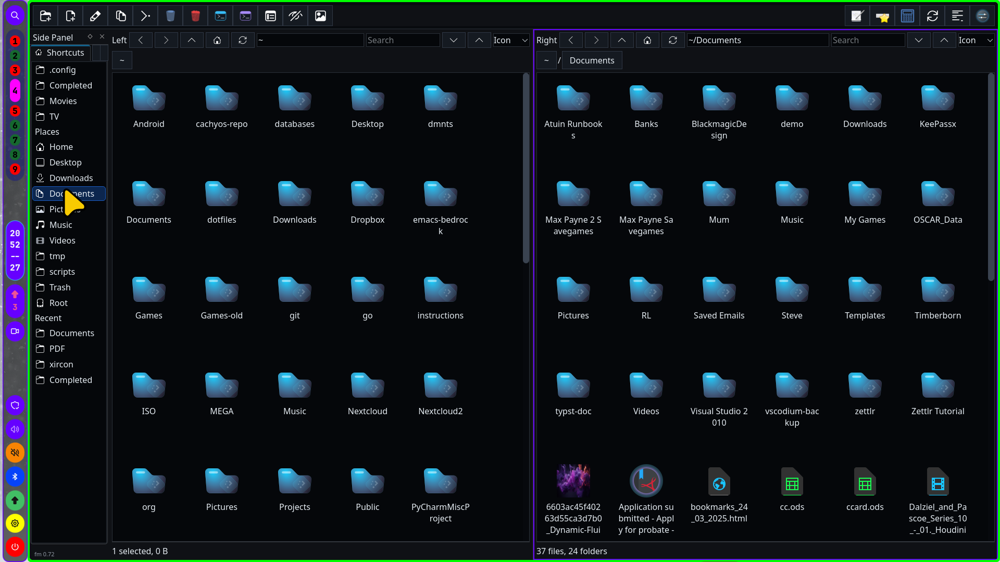

# pyside-fm

`pyside-fm` is a dual-pane file manager written in Python with PySide6.

This project is developed with AI assistance. Code, UI behavior, documentation, and iteration notes have been created and refined through human direction with AI-generated implementation support.

## Screenshot



## Features

- Dual-pane file browsing with independent paths and view modes.
- Icon, list, and details views.
- Breadcrumb navigation and compact `~/...` path display.
- Sidebar with favorites, places, recent folders, tree view, and Trash shortcut.
- Copy, move, duplicate, rename, archive, extract, trash, delete, and undo support.
- Copy/move progress dialogs reserve enough height for buttons on tiling/window-managed desktops such as MangoWM.
- Drag and drop copy/move between panes.
- Active pane zoom with `Z` while a file pane or full preview is focused.
- Text, image, and PDF previews.
- Full-pane preview in the opposite pane, with Escape to close.
- Full-pane preview zoom with Ctrl++ / Ctrl+= and Ctrl+-.
- PDF preview page navigation with buttons and keyboard controls.
- Comprehensive tabbed Help system.
- Dual Bookmarks dropdown for opening saved left/right folder pairs.
- Configurable icon layout density: Compact, Normal, Spacious.
- Per-pane icon zoom persistence.
- Theme support: Light, Dark, Very Dark.
- Custom user toolbar buttons.
- Open With menu using cached desktop entries and cached application icons.
- Default application editing from file Properties using desktop MIME associations.
- Persistent fm-only folder emblems.

## Requirements

- Python 3
- PySide6
- PySide6 QtPdf support

Run directly:

```bash
./fm
```

Keep it attached to the launching terminal:

```bash
./fm --no-detach
```

Open with optional pane paths and view modes:

```bash
./fm ~/Downloads icon ~/Documents details
```

Valid view modes:

```text
icon
list
details
```

## Main Window

The app has two file panes:

- Left pane
- Right pane

Each pane has:

- Navigation buttons
- Path field
- Search field
- Icon zoom buttons
- View mode selector
- Breadcrumb buttons
- File view
- Status line
- Optional preview area

The active pane is highlighted. Most commands operate on the active pane.

## Toolbar

The top toolbar contains:

- New Folder: create a folder in the active pane.
- New File: create a file in the active pane.
- Rename: rename the selected item.
- Copy Across: copy selected or tagged items to the other pane.
- Move Across: move selected or tagged items to the other pane.
- Trash: move selected or tagged items to Trash.
- Empty Trash: permanently remove contents of `~/.local/share/Trash/files` and clear matching trash info. The toolbar icon is red to distinguish it from normal Trash.
- Terminal Here: open the configured terminal in the active pane folder.
- Terminal Home: open the configured terminal in `~`.
- Properties: show properties for the selected item or current folder.
- Hidden: toggle hidden files.
- Preview: toggle automatic preview panes.
- Dual Bookmarks dropdown: open a saved pair of left/right folders. It sits in the top-center toolbar area.
- Swap Panes: swap left and right pane paths and view modes.
- Side Panel: show or hide the side panel.
- Help: open the tabbed help system. This button is immediately left of Settings.
- Settings: open app settings.

Custom user buttons can be added in Settings. Each user button can have:

- Label
- Symbol or icon
- Command

Icon values can be:

```text
icon:theme-icon-name
/path/to/icon.png
plain text glyph
```

User commands support placeholders:

```text
{path}      active pane path
{left}      left pane path
{right}     right pane path
{selected}  selected or tagged paths
```

## Dual Bookmarks

Dual Bookmarks are named pairs of folders that open both panes together.

Examples:

- Downloads / Completed
- Completed / TV
- Completed / Movies

Use the top-center toolbar dropdown to apply a dual bookmark. Choosing one entry sets the left pane to the saved left folder and the right pane to the saved right folder.

Configure Dual Bookmarks in Settings:

- Open Settings.
- Go to the Dual Bookmarks tab.
- Fill in Name, Left folder, and Right folder.
- Use Add to create a new pair.
- Select an existing pair, edit the fields, then use Update to change it.
- Use Delete to remove the selected pair.

Paths may use `~`.

## Sidebar

The sidebar has two tabs:

- Shortcuts
- Tree

Shortcut sections include:

- Favorites
- Places
- Recent

Default places include:

- Home
- Desktop
- Downloads
- Documents
- Pictures
- Music
- Videos
- tmp
- scripts
- Trash
- Root

Favorite/recent context menu actions:

- Rename Favorite
- Move Up
- Move Down
- Remove Favorite
- Remove Recent
- Clear Recent

Tree context menu actions:

- Open
- Add to Favorites
- Terminal Here
- Calculate Size

## Selection

Normal selection uses the current file view selection.

File pane single-key actions:

- `O`: open the selected/current item. Files open with the desktop default app; folders open in the pane.
- `P`: preview the selected supported file in the other pane.
- `R`: open Properties for the selected/current item.
- `E`: open the emblem menu for the selected folder.
- `Z`: zoom or restore the active pane.

Details view also supports tagging:

- Press Space to tag or untag the current row.
- Tagged files take priority over ordinary selection for copy/move/trash operations.
- Press Escape to clear selection if no manual preview is open.

In icon view, empty space between icon hit areas can be used to start rubber-band selection.

## Context Menu

Right-click in a file pane opens the file context menu.

Actions:

- Open: open folder in the current pane, or open file with the desktop default handler.
- Open With: lazily loads matching desktop applications for the selected file type.
- Other Command: enter a command manually.
- New Folder: create a folder in the current pane.
- New File: create a file in the current pane.
- Rename: rename the selected item.
- Duplicate: duplicate selected items.
- Create Archive: create an archive from selected items.
- Extract Here: extract selected archive into the current folder.
- Extract To: extract selected archive into a new chosen folder.
- Add to Favorites: add selected path to the sidebar favorites.
- Open in Other Pane: open selected folder in the opposite pane.
- Set Emblem: add or clear a persistent fm-only emblem on a selected folder.
- Preview in Other Pane: show selected text, image, or PDF file in the opposite pane.
- Copy to Other Pane: copy selected/tagged items to the opposite pane.
- Move to Other Pane: move selected/tagged items to the opposite pane.
- Move to Trash: move selected/tagged items to Trash.
- Delete Permanently: permanently delete selected/tagged items.
- Terminal Here: open a terminal in the current folder.
- Calculate Size: recursively calculate size, file count, and folder count.
- Properties: show item properties and change the desktop default application for a single file type.

## Preview

Automatic preview can be toggled with the toolbar Preview action.

Supported preview types:

- Text files
- Image files
- PDF files

Manual peer preview:

1. Right-click a supported file.
2. Choose `Preview in Other Pane`.
3. The opposite pane becomes a full-pane preview.
4. Press Escape to close and return to the normal file view.

You can also press `P` in a file pane to preview the selected supported file in the other pane.

Full-pane preview:

- Uses the whole opposite pane, not a small embedded preview area.
- Text previews are readable and scrollable.
- Image previews scale to fit and can be zoomed.
- PDF previews use a light background for readability.
- Press Escape to close and return that pane to its normal file view.

PDF preview:

- Shows rendered PDF pages.
- Uses a light preview background for readability.
- Previous and Next buttons move between pages.
- Page label shows the current page and total page count.

PDF keyboard controls while preview is open:

- Zoom in: Ctrl++ / Ctrl+=
- Zoom out: Ctrl+-
- Next page: PageDown, Right, Down
- Previous page: PageUp, Left, Up
- Close preview: Escape

Pane zoom:

- Press `Z` while a file pane or full preview is focused.
- The active pane expands to take the available pane area.
- The zoomed pane border is `#00ff00`.
- Press `Z` again to restore the previous split.

## Properties And Default Applications

Properties shows metadata for the selected/current item.

For a single file, Properties also shows:

- File MIME type
- Current matching desktop applications
- An `Open with` selector
- A `Set Default` button

Changing the default application uses:

```bash
xdg-mime default <desktop-file> <mime-type>
```

This is the same desktop association system used by most Linux file managers. After changing a default, `O`, Enter, Ctrl+O, and the context menu Open action use the new default handler.

## Folder Emblems

Folder emblems are visual markers shown inside `fm`.

To set one:

1. Right-click a folder.
2. Open `Set Emblem`.
3. Choose an emblem.

You can also select a folder in a file pane and press `E`.

Available emblems:

- Star
- Important
- Work
- TV
- Movies
- Completed
- Warning

Use `Clear Emblem` from the same menu to remove one.

Emblems are stored persistently by folder path in app settings as:

```text
folderEmblemsJson
```

They are intentionally fm-only and do not modify Thunar, GVFS, or desktop file metadata.

## Help System

Open Help with the toolbar Help button or `F1`.

Help is tabbed:

- Overview: basic workflow and selection behavior.
- Keyboard: shortcut reference using full-width rows to avoid clipped descriptions.
- Toolbar: toolbar button descriptions.
- Context Menus: file pane, sidebar, and tree menu actions.
- Preview: automatic preview, peer preview, PDF pages, preview zoom, and pane zoom.
- Settings: app settings, user buttons, Dual Bookmarks, folder emblems, and default application notes.

## Keyboard Shortcuts

Navigation:

| Action | Shortcut |
| --- | --- |
| Open selected | O / Enter / Ctrl+O |
| Go back | Backspace / Alt+Left |
| Go forward | Alt+Right |
| Go up | Alt+Up |
| Focus path bar | Ctrl+L |
| Focus pane search | Ctrl+F |
| Refresh | Ctrl+R |

File operations:

| Action | Shortcut |
| --- | --- |
| Copy selected or tagged files | Ctrl+C |
| Paste copied files into active pane | Ctrl+V |
| Move selected or tagged to other pane | Ctrl+M |
| Undo last operation | Ctrl+Z |
| Move to trash | Delete |
| Delete permanently | Shift+Delete |
| Rename | F2 |
| New folder | F7 |
| New file | Ctrl+N |
| Open terminal here | F4 |
| Properties | R / Alt+Return |
| Set folder emblem | E |

Panes and selection:

| Action | Shortcut |
| --- | --- |
| Copy to other pane | F5 |
| Move to other pane | F6 / Ctrl+M |
| Preview file in other pane | P |
| Tag or untag row in detailed view | Space |
| Swap panes | Toolbar button |
| Zoom active pane | Z while a file pane or full preview is focused |
| Drag copy | Drag and drop |
| Drag move | Shift+drag and drop |

Display and app:

| Action | Shortcut |
| --- | --- |
| Toggle hidden files | Ctrl+H |
| Zoom icons or full preview larger | Ctrl++ / Ctrl+= |
| Zoom icons or full preview smaller | Ctrl+- |
| Toggle side panel | Ctrl+B / F9 |
| Settings | Ctrl+, |
| Help | F1 |
| Quit | Ctrl+Q |
| Close help or manual preview | Escape |

## Settings

Settings include:

- Theme
- Icon layout
- Terminal command
- Terminal arguments
- Four custom user toolbar buttons
- Dual Bookmarks: named left/right folder pairs for the top-center dropdown

Default terminal:

```text
kitty
```

Default terminal arguments:

```text
--app-id=org.ai.floater
```

Icon layout presets:

- Compact
- Normal
- Spacious

## Trash

Trash uses the freedesktop user trash location:

```text
~/.local/share/Trash/files
~/.local/share/Trash/info
```

Move to Trash records undo information.

Empty Trash permanently removes files from Trash and clears trash metadata.

## Archives

Supported archive extensions:

```text
.zip
.tar
.tar.gz
.tgz
.tar.bz2
.tbz2
.tar.xz
.txz
```

Archive actions:

- Create Archive
- Extract Here
- Extract To

## Development Notes

The app version is stored in:

```python
APP_VERSION
```

Project convention:

- Update `APP_VERSION` for app source changes.
- Back up the previous build in the project backup folder before source edits:

```text
zips/fm<version>.zip
```

Example:

```text
zips/fm0.72.zip
```

The `zips/` backup folder is ignored by Git.

## Git Workflow

Check status:

```bash
git status
```

Stage changes:

```bash
git add fm README.md fm.desktop .gitignore
```

Commit:

```bash
git commit -m "Describe the change"
```

Push:

```bash
git push
```
